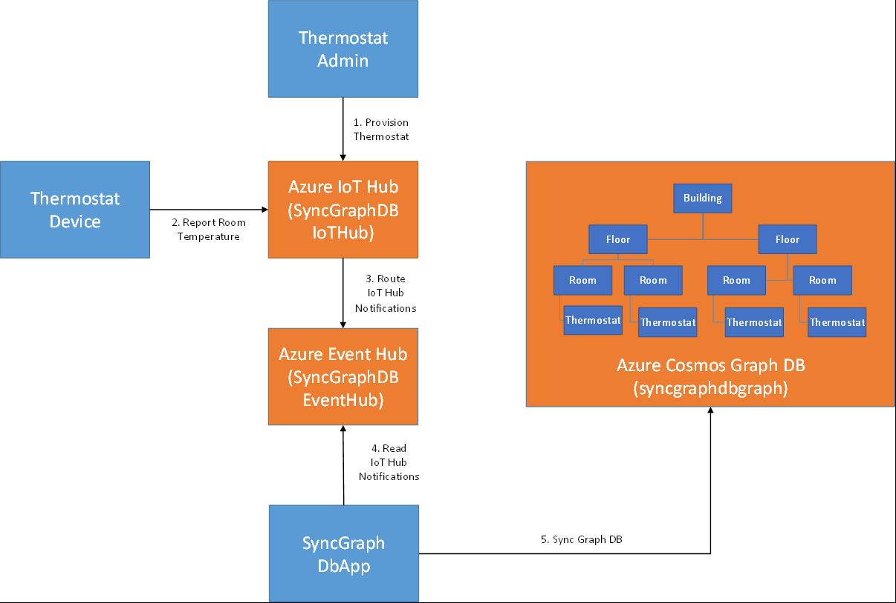

# Use device lifecycle and twins changes to replicate device data to an external store

This sample demonstrates the use of IoT Hub device lifecycle and twin change notifications to replicate device identities and twin properties to an external store - specifically an Azure Cosmos Graph Database. The sample maintains a graph of buildings, rooms, floors and thermostats. Thermostat vertices are dynamically added to the graph as new thermostat devices are provisioned and are updated as the thermostats report their room's temperature. The following diagram shows the architecture of the solution with the projects of the sample (in blue), their dependent Azure resources (in orange) and the overall data flow:



In the solution, SyncGraphDbApp simulates a cloud service that leverages Azure IoT Hub notifications to replicate thermostat data to a Cosmos DB graph. SyncGraphDbApp uses device lifecycle notifications to create Thermostat vertices in the Cosmos DB Graph for each newly provisioned thermostat whenever a new Thermostat is registered via ThermostatAdmin. As ThermostatDevice publishes the thermostat's current temperature SyncGraphDbApp updates the Temperature field of the Thermostat vertex.

##	Download sample
1.	Clone https://github.com/Azure-Samples/iot-hub-notifications-sync-graphdb
1.	Open iot-hub-notifications-sync-graphdb\src\SyncGraphDbFromTwin.sln in Visual Studio 2015 or later

##	Provision Azure resources
The sample depends on the following Azure resources:
- SyncGraphDBEventHub - The Azure Event Hub that queues device lifecycle and twin change notifications where they are processed by SyncGraphDBApp. The Event Hub is created within the SyncGraphDBNamespace namespace.
- SyncGraphDBIoTHub -  The Azure IoT Hub that maintains the sample's device registry and device twins
- syncgraphdbgraph - Azure Cosmos DB Graph which stores the sample's graph
- syncazureblob - Azure Blob store used to store SyncGraphDBEventHub's checkpoint 

The following steps provision these resources using the Azure portal:
1. Open Azure Portal
    - Provision SyncGraphDBEventHub Azure Event Hub 
    - At top of left pane click New
    - Under Azure Marketplace select Internet of Things
    - Under Featured click Create under Event Hubs
    - For Name specify SyncGraphDBNamespace-[unique id] (replacing '[unique id]' with a unique string]
    - For Resource Group select Create New and specify SyncGraphDb
    - Click Create
    - After SyncGraphDBNamespace is provisioned navigate to it
    - In left pane select Event Hubs
    - In right pane click +Event Hub
    - For Name specify SyncGraphDBEventHub
    - Click Create
1. Provision SyncGraphDBIotHub Azure IoT Hub
    - At top of left pane click New
    - Under Azure Marketplace select Internet of Things
    - Under Featured click Create under IoT Hub
    - For Name specify SyncGraphDBIoTHub-[unique id] (replacing '[unique id]' with a unique string]
    - For Resource Group select Use existing and specify SyncGraphDb
    - Click Create
1. Provision syncgraphdbgraph Cosmos Graph Database
    - At top of left pane click New
    - Under Azure Marketplace select Databases
    - Under Featured click Create under Azure Cosmos DB
    - For Name specify syncgraphdbgraph-[unique id] (replacing '[unique id]' with a unique string]
    - For API specify Gremlin
    - For Resource Group select Use existing and specify SyncGraphDb
    - Click Create
1. Provision syncazureblob Azure Blob Storage
    - At top of left pane click New
    - Under Azure Marketplace select Storage
    - Under Featured click Create under Storage account - blob, file, table, queue
    - For Name specify syncazureblob[unique id] (replacing '[unique id]' with a unique string]
    - For Account kind specify Blob storage
    - For Resource Group select Use existing and specify SyncGraphDb
1. Provision IoT Hub routes
    - Add endpoint that represents SyncGraphDBEventHub provisioned in step 1
        - Navigate to SyncGraphDBIotHub
        - In left pane select Endpoints
        - In right pane click +Add
        - For Name specify SyncGraphDBEventHub
        - For Endpoint type specify Event Hub
        - For Event Hub namespace specify SyncGraphDBNamespace
        - For Event Hub name specify SyncGraphDBEventHub
        - Click OK
    - Add route for device lifecycle events
        - In left pane select Routes
        - In right pane click +Add
        - For Name specify DeviceLifeCycleNotifications
        - For Data source specify Device Lifecycle Events 
        - For Endpoint specify SyncGraphDBEventHub
        - Click Save
    - Add route for twin change events
        - In right pane click +Add
        - For Name specify TwinChangeNotifications
        - For Data source specify Twin Change Events 
        - For Endpoint specify SyncGraphDBEventHub
        - Click Save

## Start processing notifications
SyncGraphDbApp handles the processing of device lifecycle and twin change notifications. Internally its TwinChangesEventProcessor class reads notifications routed to a SyncGraphDBEventHub and updates the graph accordingly. The processor is implemented as a typical Azure Event Hub event processor meaning it has a corresponding factory class (```TwinChangesEventProcessorFactory```), implements ```IEventProcessor``` and is triggered by a EventProcessorHost. For more information on Azure Event Hub event processors see [Event Hubs programming guide](https://docs.microsoft.com/en-us/azure/event-hubs/event-hubs-programming-guide).

```TwinChangesEventProcessor.ProcessEventAsync``` is called when a new batch of notifications arrive. ProcessEventAsync calls SyncDataAsync to process the batch and updates the event hub checkpoint based on the last successfully processed notification. The checkpoint allows SyncGraphDbApp to restart and resume processing without dropping any notifications.

Each notification is processed based on its message source and operation type. These are pulled from each notification’s ```eventData.Properties``` header along with source hub name and device ID. The following table describes the meaning of each message source and operation type combination:

| Message Source | Operation Type | Description |
| ------------------- | ------------------- | ------------------- |
| deviceLifeCycleEvents| createDeviceIdentity | A new device was registered in the hub |
| deviceLifeCycleEvents | deleteDeviceIdentity | An existing device was unregistered |
| twinChangeEvents | updateTwin | Contains a changeset to be applied to an existing twin in the graph (e.g. PATCH) |
| twinChangeEvents | replaceTwin | Contains a full twin to replace existing twin in graph (e.g. PUT) |

SyncGraphDbApp internally implements SyncCommand subclasses to process each message source and operation type combination. To start ```CreateDeviceIdentitySyncCommand``` adds a new vertex to the graph that represents a new thermostat and associates the thermostat with a Room vertex based on its location via a new edge. The sample only allows 1 thermostat to be associated with a room at a time. Also note that notifications can have duplicates. As a result conflict errors must be handled.
```csharp
try
{
    Console.WriteLine("Add new thermostat vertex ...");
    vTwin = await this.AddVertexAsync("thermostat", graphTwinId, null);
}
catch (DocumentClientException ex) when (ex.Error.Code == "Conflict")
{
    Console.WriteLine($"Thermostat vertex {graphTwinId} already exists in the graph.");
    return;
}

// replace location
Location? location = this.ParseTaggedLocation(this.jTwin);
if (location != null)
{
    await this.ReplaceLocationAsync(vTwin, location.Value);
}
```

```DeleteDeviceIdentityCommand``` removes the existing vertex for the specified thermostat and the edge associating the thermostat with a room:
```csharp
string graphTwinId = MapGraphTwinId(this.hubName, this.twinId);
Console.WriteLine($"Try remove twin {graphTwinId} from graph ...");
await this.ExecuteVertexCommandAsync($"g.V('{graphTwinId}').drop()");
```

```UpdateTwinSyncCommand``` performs two steps: 1) updates the temperature field of the thermostat's vertex and 2) associates a Thermostat vertex with a new Room vertex if its location changed:
```csharp
string graphTwinId = MapGraphTwinId(this.hubName, this.twinId);

Console.WriteLine("Get thermostat vertex ...");
Vertex vTwin = await this.GetVertexByIdAsync(graphTwinId);
if (vTwin == null)
{
    Console.WriteLine("Vertex does not exist. Execute Add command ...");
    await this.AddTwinAsync(this.hubName, this.twinId, this.jTwin);
    return;
}

Dictionary<string, string> properties = null;
string reportedTemperature = this.ParseReportedTemperature(this.jTwin);
if (!string.IsNullOrWhiteSpace(reportedTemperature))
{
    properties = new Dictionary<string, string>
    {
        {"temperature", reportedTemperature }
    };

    Console.WriteLine("Update vertex temperature property ...");
    vTwin = await this.UpdateVertexAsync(graphTwinId, properties);
}

Location? location = this.ParseTaggedLocation(this.jTwin);
if (location != null)
{
    await this.UpdateLocationAsync(vTwin, location.Value);
}
```

```ReplaceTwinSyncCommand``` has the same implementation as ```UpdateTwinSyncCommand``` since changesets and full replacements are processed in the same manner for this scenario.

To start processing events run SyncGraphDbApp as follows:
1. In Visual Studio go to SyncGraphDbApp project and open app.Settings.config
1. Set GraphDbEndpoint, GraphDbAuthKey, ServiceBusConnectionString, StorageConnectionString and IotHubConnectionString based on the names of the resources provisioned in Step 2.
    - These values can be retrieved from the Azure Portal once step 2 is complete.
1. Under Build menu select Build Solution
1. Open a command prompt
1. Go to .\iot-hub-notifications-sync-graphdb\src\SyncGraphDbApp\bin\debug
1. Run SyncGraphDbApp.exe notifications

## Provision a thermostat
As discussed earlier the ThermostatAdmin sample provisions a new thermostat for a specified room. While SyncGraphDbApp is running newly provisioned thermostats are added to the graph DB. Follow these steps to run ThermostatAdmin and view the updated graph:
1. Open command prompt
1. Go to .\iot-hub-notifications-sync-graphdb\src\ThermostatAdmin\bin\Debug
1. Run ThermostatAdmin.exe add Thermo1234
1. Note SyncGraphDbApp's console window shows Thermo1234 added to Graph DB
1. Run ThermostatAdmin.exe location Thermo1234 43 1 1R
1. Note SyncGraphDbApp's console window shows the updated location for Thermo1234
1. View new thermostat in graph DB
1. Go to syncgraphdbgraph Cosmos DB resource in Azure Portal
1. In left pane select DataExplorer
1. In Explorer's treeview go to graphdb\Devices\Graph
1. Click Apply Filter
1. In Results column select syncgraphdbiothub-Thermo1234. 
1. This is the vertex of the newly provisioned thermostat. The graph also displays the thermostat's vertex associated to its room's vertex - 1R

## Report room temperature
Finally the ThermostatDevice sample reports the current temperature of a room. While SyncGraphDbApp is running reported property updates from thermostats are committed to the Graph DB. Follow these steps to run ThermostatDevice and view the graph updates:
1. Go to .\iot-hub-notifications-sync-graphdb\src\ThermostatDevice
1. Run ThermostatDevice.exe Thermo1234 85
1. Note SyncGraphDbApp's console window shows Thermo1234 temperature is updated to 85 degrees
1. View new thermostat in graph DB
1. Go back to syncgraphdbgraph Cosmos DB resource in Azure Portal
1. Select DataExplorer
1. In Explorer's treeview go to graphdb\Devices\Graph
1. In Results column select syncgraphdbiothub-Thermo1234. 
1. Note that temperature is now 85

# Tips & Tricks
- SyncGraphDbApp is a single instance console application that demonstrates how to consume IoT Hub notifications and update an external store. In order to make the solution scale it needs to be hosted in an Azure Worker Role which scales to multiple instances and listens on a partitioned Event Hub. IoT Hub notifications use the notification's device ID as the Event Hub partition key. As a result device lifecycle and twin change notifications are routed to a partition based on the notification's device ID. Read more on [Event Hubs features](https://docs.microsoft.com/en-us/azure/event-hubs/event-hubs-features).
- When processing twinChangeEvents notifications both replaceTwin and updateTwin opTypes must be processed to ensure the latest changes are synced
- In the sample the IoT Hub routes are created when the IoT Hub is created. As a result the target Event Hub contains all the device lifecycle and twin change events from the start of the hub's lifetime. This ensures SyncGraphDBApp receives all the events needed to completely sync the graph DB. However if the SyncGraphDBApp needs to sync a hub that was previous created or if SyncGraphDBApp became unavailable for a period of time longer than the Event Hub's retention policy, SyncGraphDBApp would need a way to catch up. Such a catch up procedure would work as follows:
1. Create IoT Hub's routes as explained previously
1. Query IoT Hub for all twins and update Graph DB with results. SyncGraphDBApp's Program.RunSyncSampleAsync shows a simplistic implementation of this step. 
1. Start processing notifications and only commit twin change notifications whose version is greater than the version in the Graph DB. 
1. The routes created in this sample simply specify a source and a target for the notifications. IoT Hub routes also support a powerful filtering mechanism called a condition. For instance, if a thermostat reports a temperature over a specific threshold, the notification can be sent to another target that handles this condition differently (i.e. converts notification to a high priority email). The following route configuration includes a condition such that the notification is only forwarded to the specified target endpoint if the temperature reported property is over 100:
```json
{
    "name": "TemperatureExceedsThreshold",
    "source": "TwinChangeEvents",
    "condition": "$body.properties.reported.Temperature.NewValue > 100",
    "endpointNames": [
        "TemperatureExceedsThresholdNotifications"
    ],
    "isEnabled": true
}
```

# Contributing

This project welcomes contributions and suggestions.  Most contributions require you to agree to a
Contributor License Agreement (CLA) declaring that you have the right to, and actually do, grant us
the rights to use your contribution. For details, visit https://cla.microsoft.com.

When you submit a pull request, a CLA-bot will automatically determine whether you need to provide
a CLA and decorate the PR appropriately (e.g., label, comment). Simply follow the instructions
provided by the bot. You will only need to do this once across all repos using our CLA.

---
This project has adopted the [Microsoft Open Source Code of Conduct](https://opensource.microsoft.com/codeofconduct/).
For more information see the [Code of Conduct FAQ](https://opensource.microsoft.com/codeofconduct/faq/) or
contact [opencode@microsoft.com](mailto:opencode@microsoft.com) with any additional questions or comments.
